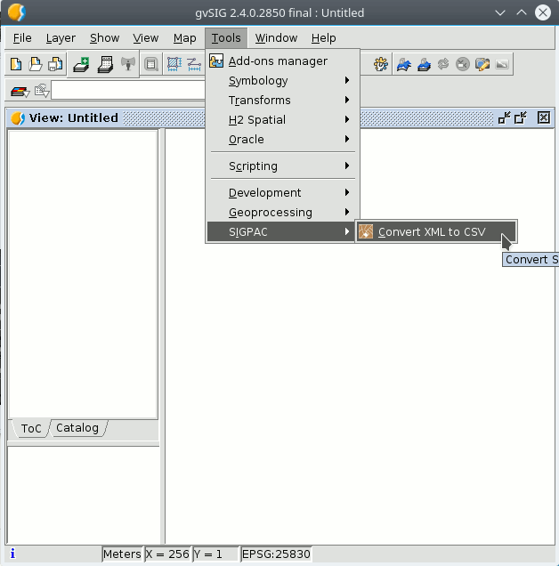

 
Convertir XML del SIGPAC a CSV
=================================

Esta utilidad permite convertir un fichero XML del SIGPAC a formato CSV y
cargarlo en una vista de gvSIG desktop.

La utilidad pide al usuario que seleccione un fichero XML del SIGPAC y 
genera un fichero CSV junto a el, cambiando la extension xml por csv.
Una vez terminada la conversion pregunta al usuario si desea cargar el 
fichero CSV en la vista actual de gvSIG.

